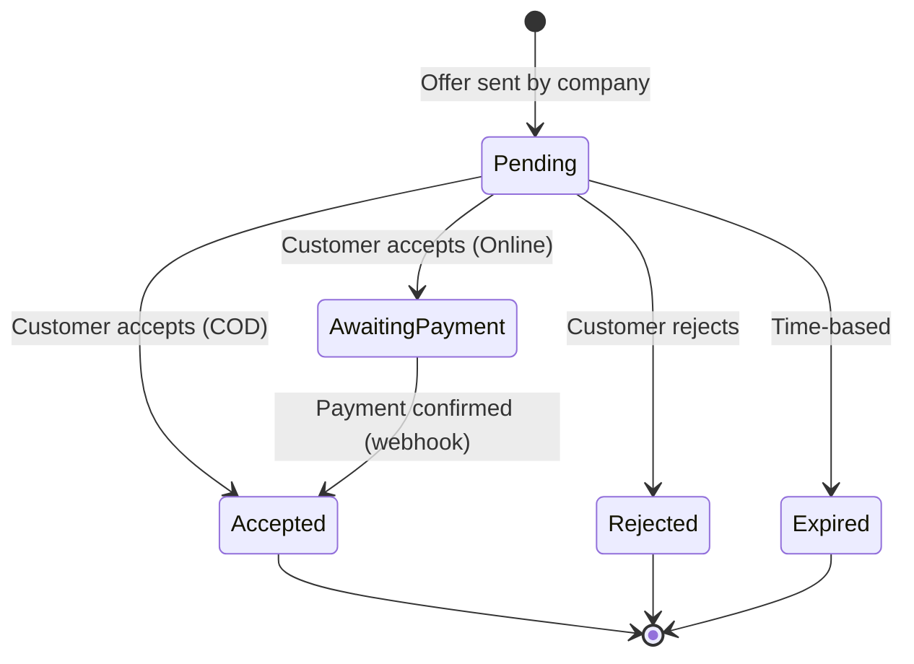
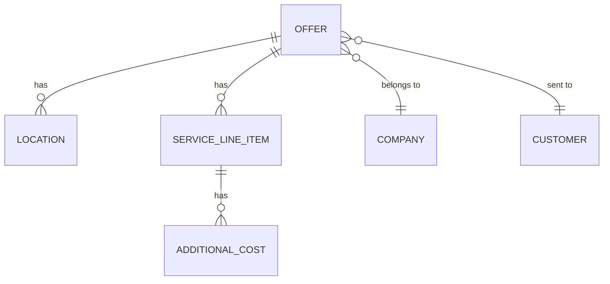

# Data Model: Customer Offers Flow

**Feature**: 033-add-offers-flow | **Date**: 2026-04-23

## Domain Entities

### OfferDetails

Full offer view model loaded from `GET /api/customer-portal/my/offers/{offerId}`.

| Field | Type | Nullable | Source (API) | Notes |
|---|---|---|---|---|
| offerId | int | ✗ | `offerId` | Primary key |
| offerNumber | String | ✓ | `offerNumber` | Display in app bar |
| companyId | int | ✗ | `companyId` | |
| companyName | String | ✓ | `companyName` | Display in summary |
| status | String | ✓ | `status` | Raw status string |
| normalizedFilter | OfferFilter | ✗ | Derived | For color mapping via `OfferFilter.fromQueryValue` |
| serviceTypeOverall | String | ✓ | `serviceTypeOverall` | Rendered as chips |
| totalAmount | double | ✗ | `totalAmount` | EGP |
| discountAmount | double | ✗ | `discountAmount` | Savings display |
| issueDate | DateTime | ✓ | `issueDate` | |
| acceptDate | DateTime | ✓ | `acceptDate` | |
| digitalSignature | String | ✓ | `digitalSignature` | Shown post-acceptance |
| rejectionReason | String | ✓ | `rejectionReason` | Shown post-rejection |
| insurance | String | ✓ | `insurance` | Rich text content |
| includedInPrice | String | ✓ | `includedInPrice` | Rich text content |
| costsIncludeVAT | bool | ✓ | `costsIncludeVAT` | Badge flag |
| pdfUrl | String | ✓ | `pdfUrl` | Attachment download |
| locations | List\<OfferLocation\> | ✗ | `locations` | Defaults to empty |
| serviceLineItems | List\<OfferServiceLineItem\> | ✗ | `serviceLineItems` | Defaults to empty |

**Computed Properties**:
- `hasDiscount` → `discountAmount > 0`
- `isAccepted` → `status?.toLowerCase() == 'accepted'`
- `isRejected` → `status?.toLowerCase() == 'rejected'`
- `isPending` → `status?.toLowerCase() == 'pending'`
- `canAccept` → `isPending` (only pending offers can be accepted)
- `canReject` → `isPending` (only pending offers can be rejected)
- `hasAttachment` → `pdfUrl != null && pdfUrl!.isNotEmpty`
- `originLocation` → first location where `locationType?.toLowerCase() == 'origin'`
- `destinationLocation` → first location where `locationType?.toLowerCase() == 'destination'`
- `hasMultipleLocations` → `locations.length > 1`

---

### OfferLocation

Mapped from `OfferLocationSummaryDto`.

| Field | Type | Nullable | Source (API) | Notes |
|---|---|---|---|---|
| locationType | String | ✓ | `locationType` | "Origin", "Destination", or unknown |
| addressIndex | int | ✗ | `addressIndex` | Sort order |
| street | String | ✓ | `street` | |
| zipCode | String | ✓ | `zipCode` | |
| city | String | ✓ | `city` | |
| countryCode | String | ✓ | `countryCode` | |
| buildingType | String | ✓ | `buildingType` | |
| floor | String | ✓ | `floor` | |
| hasLift | bool | ✓ | `hasLift` | Display as Yes/No |

**Computed Properties**:
- `displayTitle` → locationType if known ("Origin"/"Destination"), else "Location" fallback (FR-010)
- `formattedAddress` → join non-null [street, city, countryCode] with ", "

---

### OfferServiceLineItem

Mapped from `OfferServiceLineItemSummaryDto`.

| Field | Type | Nullable | Source (API) | Notes |
|---|---|---|---|---|
| serviceType | String | ✓ | `serviceType` | Card header label |
| totalLinePrice | double | ✗ | `totalLinePrice` | Card header amount |
| serviceDetails | Map\<String, dynamic\> | ✓ | `serviceDetails` | Dynamic key-value pairs |
| additionalCosts | List\<AdditionalCostSummary\> | ✗ | `additionalCosts` | Defaults to empty |

**Known serviceDetails keys** (FR-013):
`cleaningType`, `durationHours`, `numberOfStaff`, `fillNailHoles`, `withHighPressureCleaner`, `cleaningDate`, `cleaningStartTime`, `deliveryDate`, `deliveryTime`, `discount`

---

### AdditionalCostSummary

| Field | Type | Nullable | Source (API) |
|---|---|---|---|
| description | String | ✓ | `description` |
| price | double | ✗ | `price` |

---

### PaymentMethod (enum)

| Value | API int | Display |
|---|---|---|
| cod | 0 | Cash on Delivery |
| online | 1 | Online Payment |

---

## Submission Payloads

### AcceptOfferPayload

Sent to `POST /api/customer-portal/my/offers/{offerId}/accept`.

| Field | Type | Required | Validation |
|---|---|---|---|
| digitalSignature | String | ✓ | Non-empty, must start with "SIG-" (FR-020) |
| paymentMethod | PaymentMethod | ✓ | Must be selected (FR-023) |

### RejectOfferPayload

Sent to `POST /api/customer-portal/my/offers/{offerId}/reject`.

| Field | Type | Required | Validation |
|---|---|---|---|
| rejectionReason | String | ✓ | Non-empty (FR-026), max 2000 chars (FR-026) |

---

## State Transitions

## Relationships

